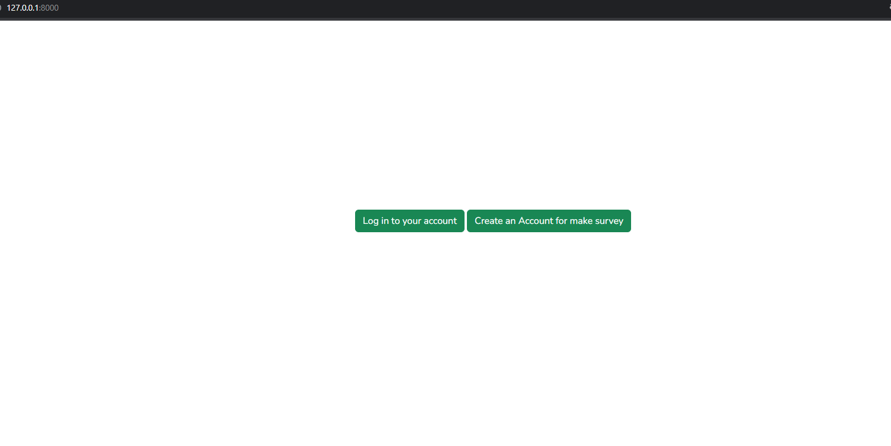
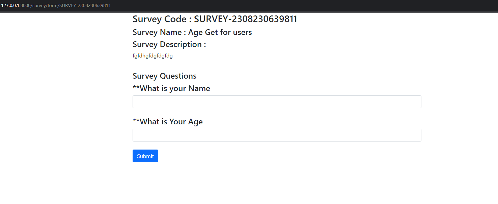

# laravel_sarvey

*I've created the project using Laravel-9 HTML, Bootstrap.

*You must have PHP version > 8

*After cloning the project from github go inside the project directory and run cmd in that directory.

*After opening cmd run the command "composer update"

*After finihing updating the composer run "php artisan migrate"

**After migrating run "php artisan serve". Then the project server will start running and you have to put "http://127.0.0.1:8000/" this url in your browser and the project will start.

User can register to this app by giving name email password.

*Only logged in user can create a survey form.

*After creating the survey user has to create question for his survey.By clicking on the create question button beside an individual suvey
user will redirect to the survey's question create page and he will post question as much he wants.

*A view question button is also beside the survey list. By clicking on the button user will redeirect to his survey form and he can share the form page link to anyone for their feedback.Any user with a browser can fillup the form.

*After submitting the form the survey form owner will get a mail about a new feedback submission.
*****Note: I've used gmail smtp

*He can watch the feedback by clicking on view feedbacks button.After going to the feedback page user will see the list of feedback

*After clicking on View Answers he'll see the feedback answers

 
